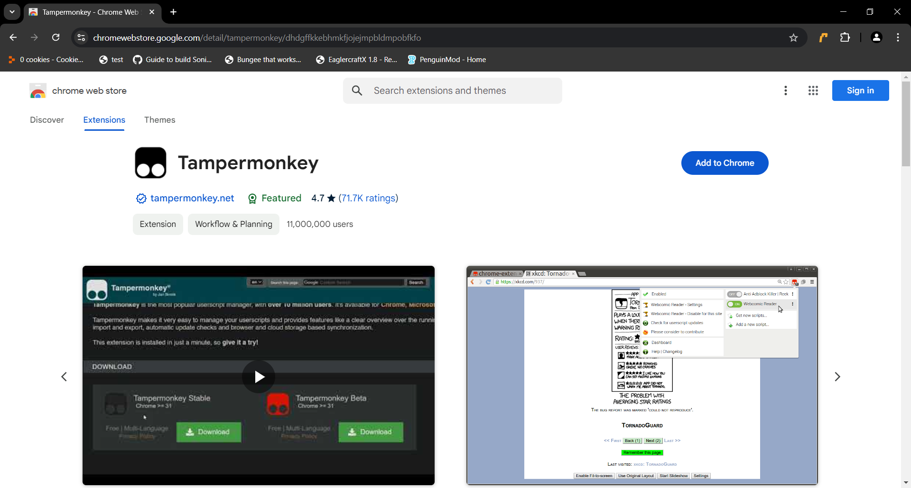
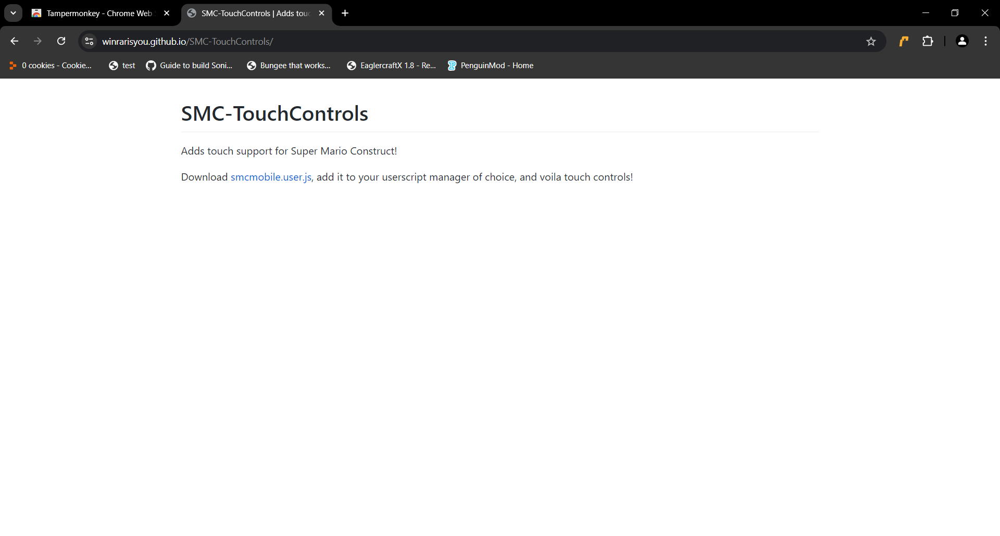
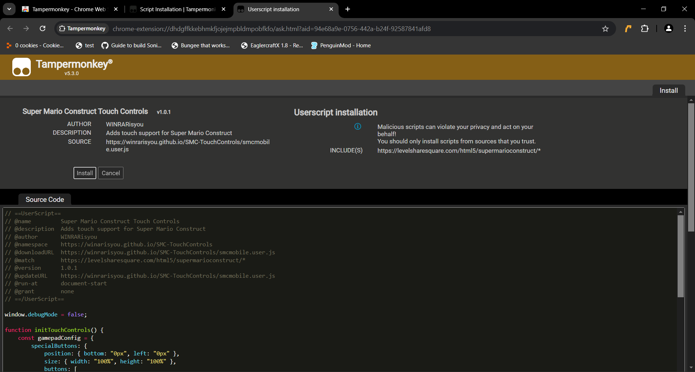
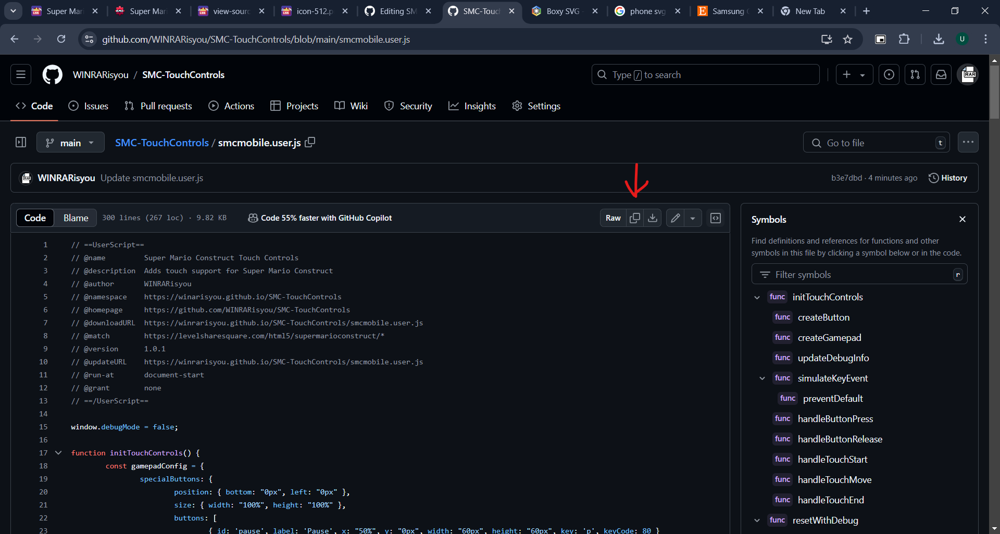
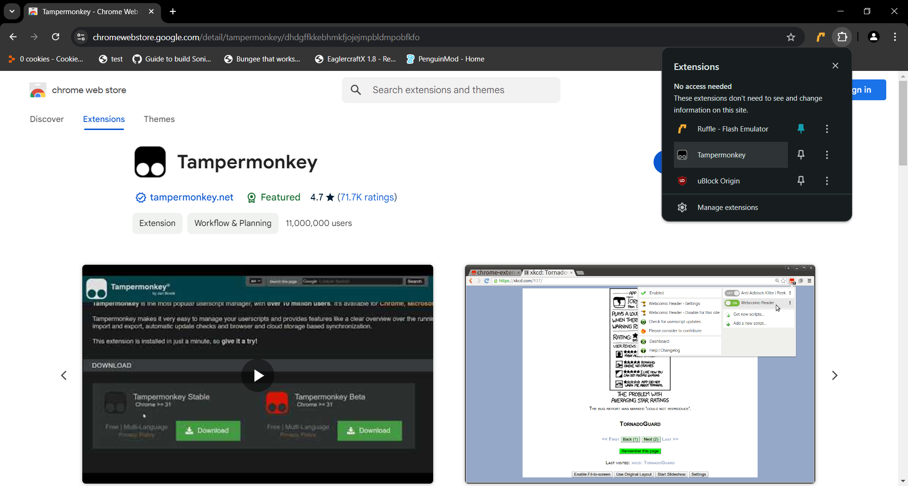
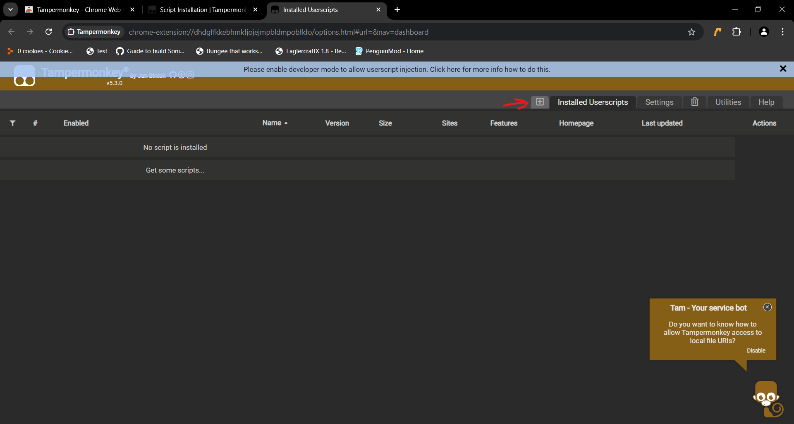
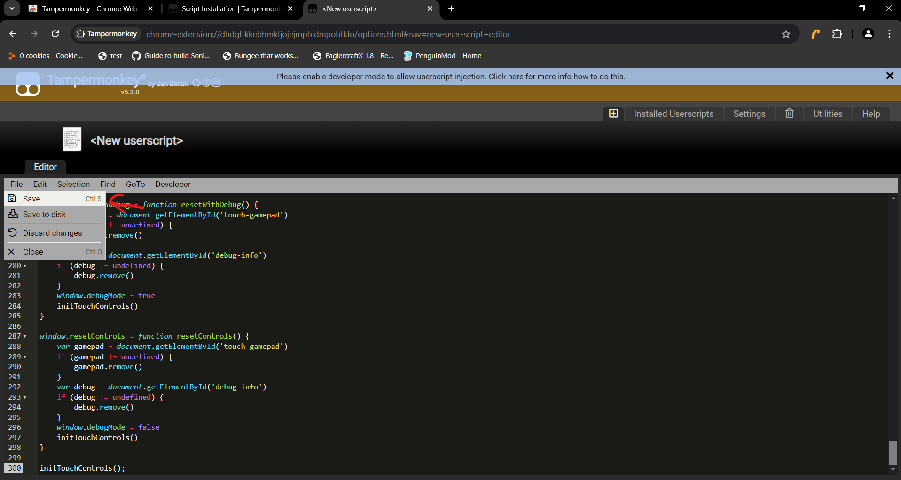

# SMC-TouchControls
Adds touch support for Super Mario Construct!

Download [smcmobile.user.js](https://winrarisyou.github.io/SMC-TouchControls/smcmobile.user.js), add it to your userscript manager of choice, and voila touch controls! Source code [here](https://github.com/WINRARisyou/SMC-TouchControls), changelog [here](https://github.com/WINRARisyou/SMC-TouchControls/tree/main/changelog.md)

# Disclaimer: It's going to lag
You're playing a PC optimized game on your mobile browser. Unless your phone is a NASA supercomputer in disguise, it's probably not going to run very well. It's not their fault, so don't berate them in the discord saying it runs poorly on your phone. If it runs really bad on Firefox, use the Chrome method. It's more tedious, but it runs faster. Also, this is an unofficial tool, developed by someone who has 0 relations to the devlopment of Super Mario Construct. If something goes wrong while using this (crashes, freezes, etc.), I probably messed up somewhere. Finally, this tool is not for creating levels on the go. If I can figure out how to make right click work to erase, then maybe I'll add an editor mode. For the forseeable future, though, it's staying as a way to play levels only.

# Installation
## Automatic (PC)
This is if you have a PC/laptop with a touchscreen display
### Step 1.
Go to [The Chrome Webstore](https://chromewebstore.google.com), and search tampermonkey and click on the first result (it should be featured)

Then install it by clicking Add to Chrome/Edge/Opera/Whatever your browser is.

### Step 2.
Once installed, go to to [this page (you're already there)](https://winrarisyou.github.io/SMC-TouchControls) and click on smcmobile.user.js

### Step 3.
It should bring up a popup that looks like this, and just press install and you're done :)

It'll be active the next time you open SMC.

## Manual (PC)
### Step 1.
If for some reason, the userscript isn't automatically installed when you click on the link, go to [this page](https://github.com/WINRARisyou/SMC-TouchControls/blob/main/smcmobile.user.js), and press the copy button

### Step 2.
Open up the tampermonkey dashboard by pressing the puzzle piece in the top right, pressing Tampermonkey and hitting dashboard

### Step 3.
Finally, paste in the code from Step 1, press file and save, and you're done :D

## Mobile (Android Firefox)
## Automatic
<video controls width="25%" src="images/mobile-automatic.mp4" title="Title"></video>

## Manual
I added the wrong video (oops). The steps are essentially the same as the PC manual one. I'll add the proper video later

## Mobile (Chrome)
Copy the text from [chrome.js](https://winrarisyou.github.io/SMC-TouchControls/chrome.js) and follow instructions in video. The name is important, it will be how you access it. Make sure the one you are clicking starts with javascript:
This method should work iOS but I don't own any apple devices so I can't test it. Someone has said this didn't work for them so your mileage may vary.

<video controls width="25%" src="images/chrome.mp4" title="Title"></video>
